# 🎾 RENSIUS - Reservation and Sport Utility System

**RENSIUS** adalah aplikasi *Sport Venue Marketplace & Reservation System* berbasis mobile yang dirancang untuk mendigitalisasi proses pencarian, penyewaan, dan pengelolaan fasilitas olahraga dalam satu platform terintegrasi. 

Aplikasi ini dibangun menggunakan **Flutter** untuk sisi klien dan didukung oleh **Supabase** sebagai *backend & database* awan, lengkap dengan simulasi pembayaran digital via **Midtrans Sandbox** dan pemetaan geospatial menggunakan **Google Maps API**.

---

## 👥 Hak Akses & Fitur Utama (Multi-Role)

Aplikasi ini mendukung tiga peran pengguna dengan hak akses dan fitur yang disesuaikan secara dinamis:

### 1. Pelanggan (End Users / Customers)
* **Autentikasi Mandiri:** Register dan login menggunakan email, *username*, nomor telepon, dan kata sandi via Supabase Auth.
* **Eksplorasi Lapangan:** Mencari lokasi arena olahraga terdekat berbasis koordinat peta interaktif (*Google Maps API*).
* **Penyaringan Lapangan:** Memfilter pencarian berdasarkan cabang olahraga, range harga sewa, lokasi daerah, dan fasilitas.
* **Reservasi Real-Time:** Memesan slot jadwal sewa lapangan secara langsung tanpa perlu konfirmasi manual kepada pengelola.
* **Sewa Peralatan (Layanan Tambahan):** Menyewa alat penunjang olahraga (seperti raket, bola, atau cone) secara langsung saat memesan lapangan.
* **Pembayaran Non-Tunai:** Proses pembayaran digital otomatis terintegrasi menggunakan simulator Midtrans Sandbox.
* **Poin Loyalitas (Cashback & Diskon):** Memperoleh poin cashback 1% dari transaksi pembayaran dan dapat menggunakannya sebagai potongan harga sewa berikutnya.
* **Riwayat & Bukti Transaksi:** Memantau daftar transaksi berjalan/selesai serta melihat bukti e-kuitansi pembayaran digital secara lengkap.
* **Chat dengan Pengelola:** Sistem perpesanan teks pribadi langsung ke pemilik arena untuk koordinasi sewa lapangan.
* **Rating & Ulasan:** Memberikan ulasan tertulis dan rating bintang (1-5) setelah jadwal bermain selesai.

### 2. Pengelola Fasilitas (Venue Owners)
* **Registrasi Mitra:** Mendaftarkan akun owner dengan melampirkan berkas identitas resmi (KTP, NPWP, dan NIK) ke Supabase Storage.
* **Manajemen Venue & Lapangan:** Menambahkan data arena olahraga, deskripsi fasilitas, menentukan jam buka-tutup, mengunggah foto, dan membagi tipe lapangan (tipe lantai/ukuran).
* **Manajemen Sewa Alat:** Menambahkan daftar perlengkapan olahraga yang dapat disewa beserta tarif rental.
* **Laporan Finansial:** Dasbor pemantauan kinerja bisnis berupa grafik garis tren pendapatan mingguan (Senin-Minggu) dan rincian transaksi harian.
* **Chat Pelanggan:** Menerima dan membalas obrolan langsung dari penyewa arena.

### 3. Administrator (Admin)
* **Dasbor Statistik:** Panel pemantauan jumlah owner terdaftar, permohonan verifikasi pending, dan verifikasi sukses.
* **Verifikasi Dokumen Owner:** Meninjau berkas NIK/NPWP/KTP pengaju dengan opsi menyetujui (*Approve*) atau menolak (*Reject* - dengan alasan penolakan).
* **Moderasi Venue Baru:** Memvalidasi data lapangan olahraga yang diajukan owner sebelum diterbitkan secara publik di aplikasi.
* **Broadcast Notifikasi:** Mengirim pengumuman otomatis ke pengelola saat permohonan disetujui, dan siaran info venue baru ke seluruh pengguna.

---

## 🛠️ Stack Teknologi

| Komponen | Teknologi yang Digunakan |
| :--- | :--- |
| **Mobile App** | Flutter (Dart) |
| **Backend & Cloud Service** | Supabase (PostgreSQL, Auth, Storage) |
| **External API** | Google Maps Platform, Midtrans Sandbox |
| **Local Notifications** | `flutter_local_notifications` |
| **Local Caching** | `shared_preferences` |

---

## 🚀 CI/CD Android Release

Repository ini memiliki workflow GitHub Actions untuk membangun APK Android secara otomatis saat ada push ke branch `main`, tag `v*`, atau saat dijalankan manual dari tab **Actions**.

Panduan lengkap penggunaan workflow, konfigurasi secret `ENV_FILE`, artifact APK, dan GitHub Release otomatis tersedia di [GITHUB_ACTIONS_ANDROID_RELEASE.md](GITHUB_ACTIONS_ANDROID_RELEASE.md).

Dokumentasi kontrak API Supabase, Storage, dan Midtrans tersedia di [API_DOCUMENTATION.md](API_DOCUMENTATION.md).

---

## ⚙️ Langkah Instalasi & Konfigurasi

### 1. Konfigurasi Environment (`.env`)
Buat berkas bernama `.env` di folder root proyek (sejajar dengan `pubspec.yaml`), lalu isi kredensial berikut:

```env
# Supabase Credentials
SUPABASE_URL=https://your-project-id.supabase.co
SUPABASE_ANON_KEY=your-anon-public-key-here

# Google Maps API Key
GOOGLE_MAPS_API_KEY=your-google-maps-api-key-here
ANDROID_MAPS_API_KEY=your-android-maps-api-key-here
IOS_MAPS_API_KEY=your-ios-maps-api-key-here

# Midtrans Credentials
MIDTRANS_MERCHANT_ID=your-midtrans-merchant-id-here
MIDTRANS_CLIENT_KEY=your-midtrans-client-key-here
MIDTRANS_SERVER_KEY=your-midtrans-server-key-here
```

### 2. Inisialisasi Database Supabase
Jalankan seluruh skrip SQL yang berada pada file `schema.sql` di dalam **SQL Editor** pada konsol Supabase Anda untuk membuat tabel-tabel berikut:
* `verifications` (Registrasi Owner & Venue)
* `users` (Profil Pengguna terverifikasi)
* `venues` (Detail arena olahraga)
* `bookings` (Detail reservasi slot & sewa)
* `reviews` (Rating & ulasan)
* `chats` (Obrolan chat)
* `notifications` (Notifikasi sistem)

### 3. Konfigurasi Storage Bucket
Buat 3 bucket baru dengan status **Public Bucket** di menu Storage Supabase:
* `profiles` (Menyimpan foto profil)
* `documents` (Menyimpan berkas identitas KTP/NPWP owner)
* `venues` (Menyimpan foto dokumentasi lapangan)

Terapkan kebijakan keamanan (*RLS Policies*) untuk masing-masing bucket agar aplikasi diizinkan melakukan *Insert, Select,* dan *Update*.

### 4. Menjalankan Aplikasi
Buka terminal pada folder proyek Anda dan jalankan perintah berikut secara berurutan:
```bash
# 1. Bersihkan cache
flutter clean

# 2. Unduh dependensi
flutter pub get

# 3. Jalankan aplikasi pada emulator atau perangkat fisik Anda
flutter run
```

---

## 📸 Dokumentasi Aplikasi (Screenshots)

Berikut adalah beberapa tampilan utama dari aplikasi **RENSIUS**:

### Alur Pelanggan (Customer Flow)
| Halaman Login | Beranda & Profile | Detail Lapangan | Halaman Keranjang |
| :---: | :---: | :---: | :---: |
| 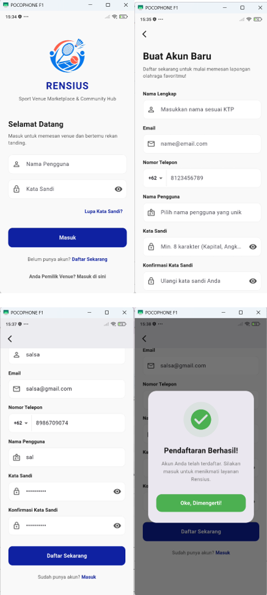 | 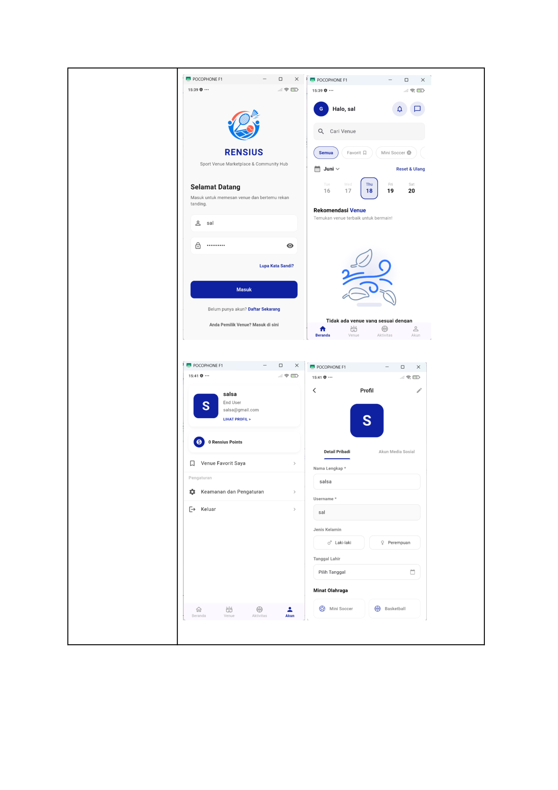 | 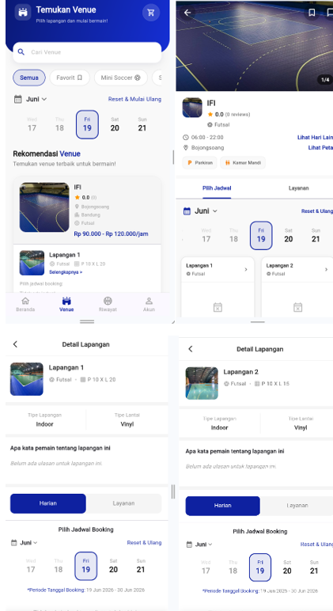 | 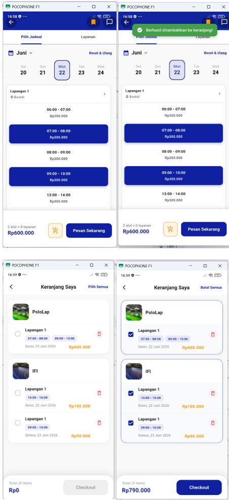 |

| Metode Pembayaran | Midtrans Snap Simulator | Pembayaran Berhasil | Riwayat & E-Kuitansi |
| :---: | :---: | :---: | :---: |
| 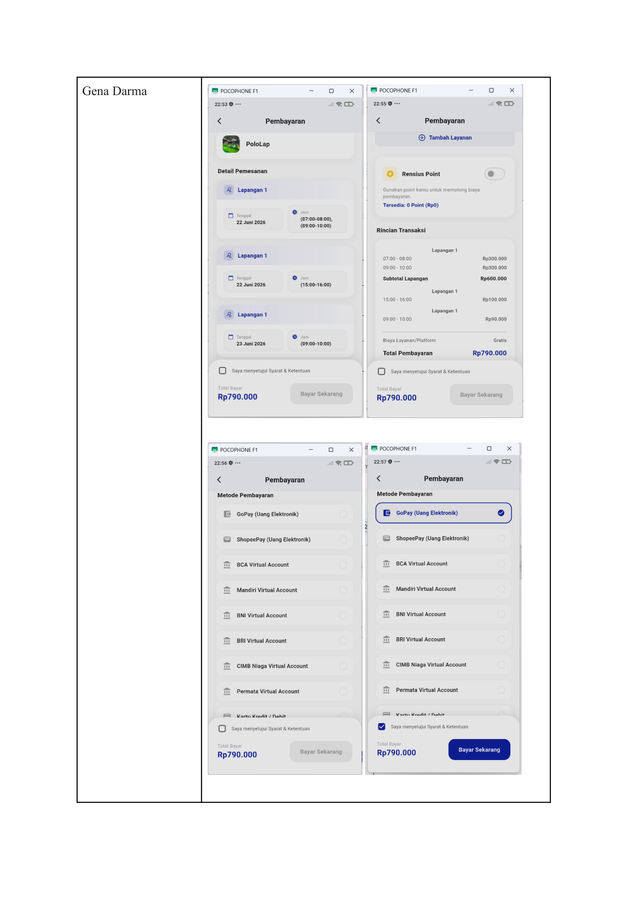 | 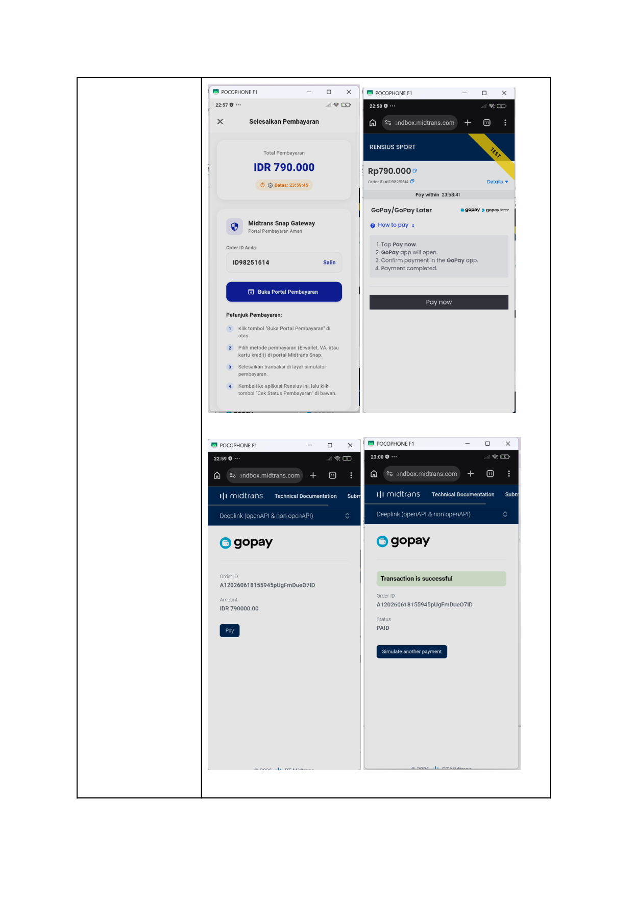 | 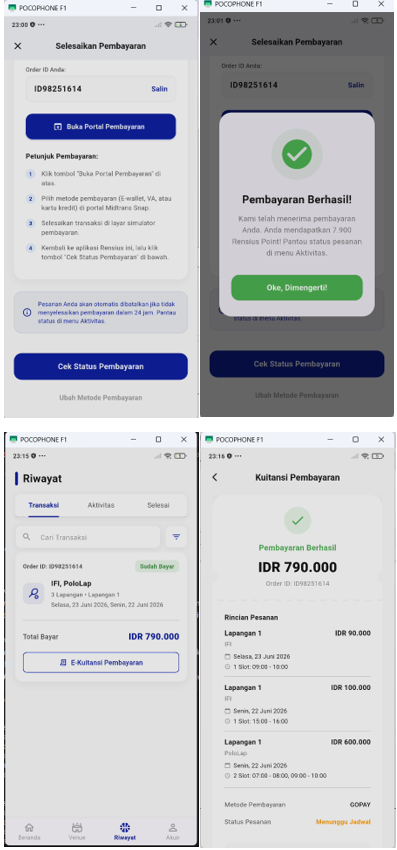 | 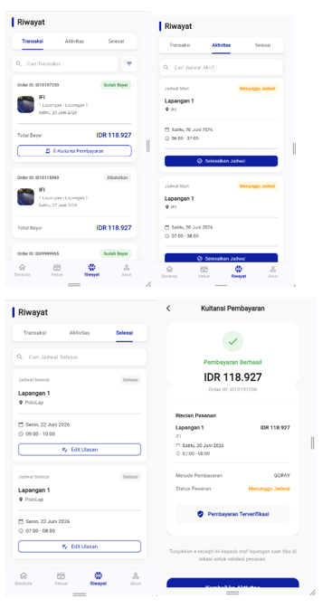 |

### Alur Pengelola Venue (Owner Flow)
| Registrasi Akun Owner | Tambah Venue (Form Utama) | Tambah Venue (Detail Lapangan) |
| :---: | :---: | :---: |
| 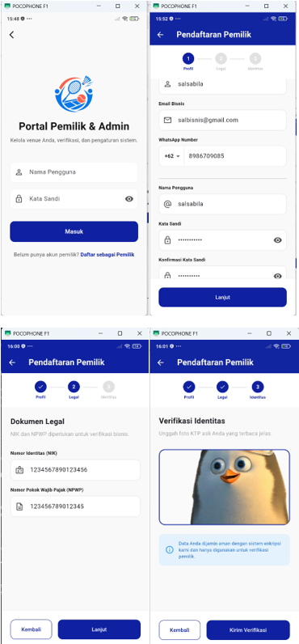 | 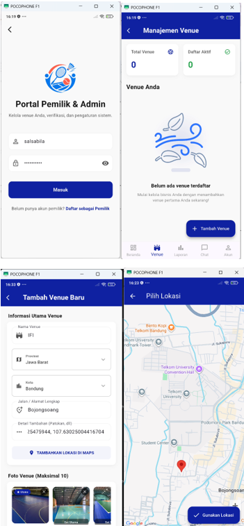 | 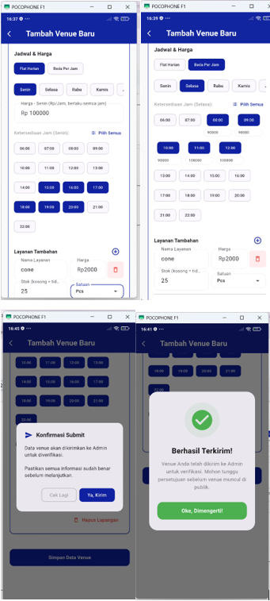 |

| Beranda Dashboard & Venue Owner | Grafik Finansial & Laporan | Halaman Chat Pelanggan |
| :---: | :---: | :---: |
| 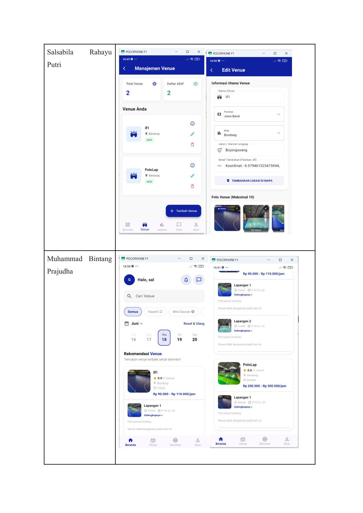 | 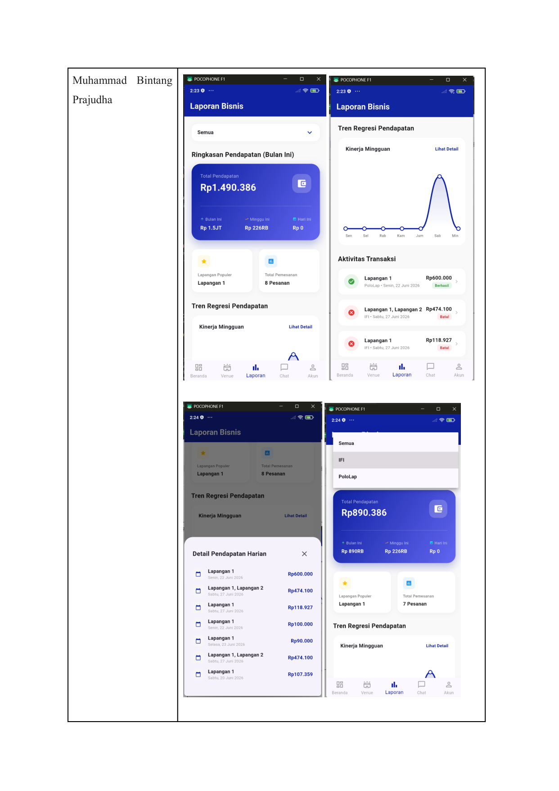 | 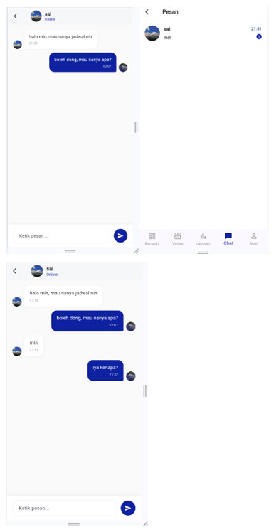 |

### Alur Administrator (Admin Flow)
| Dashboard Admin | Verifikasi Owner | Aktivasi Lapangan Baru |
| :---: | :---: | :---: |
| 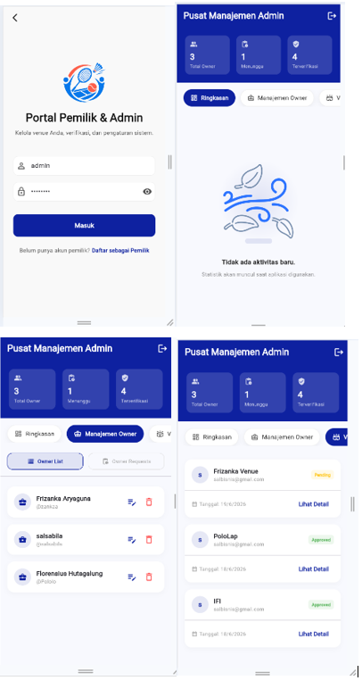 | 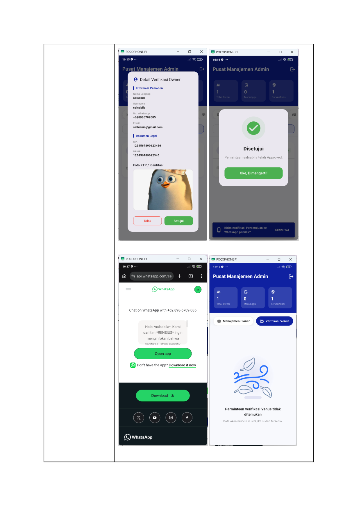 | 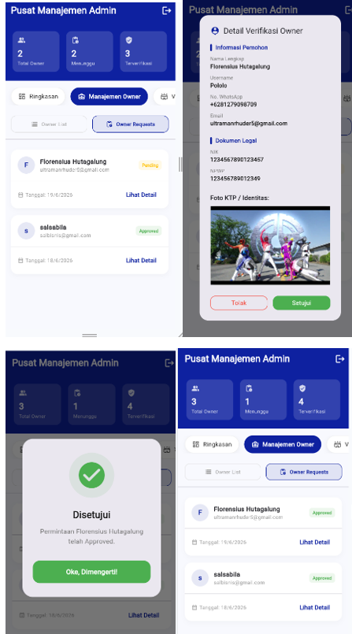 |
